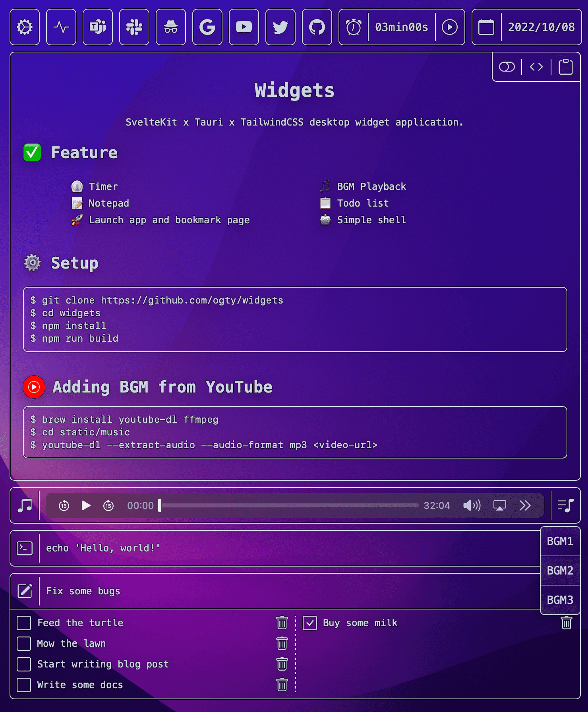

<h1 align="center">Widgets</h1>

<div align="center">
  
</div>

## ⚙️ Add a component

### 🔑 Available Keys

- `name`
- `icon`
- `path`
- `url`
- `default`

If a `url` is present, a component is generated that opens the specified page.<br />
If `app` is present, a component that opens the specified app is generated.

**`components.json`**

```json
[
  {
    "name": "GitHub",
    "icon": "Github",
    "url": "https://github.com",
    "default": true
  }
]
```

### 🤖 Create and Execute

```zsh
$ make run
```

### 📷 Creating icons from components.json

```zsh
$ make download-icons
```

<details>
  <summary>Template</summary>

```json
{
  "name": "",
  "icon": "",
  "url": "",
  "path": "",
  "default": true
}
```

</details>

## 🎵 Adding BGM from YouTube

```
$ brew install youtube-dl ffmpeg
$ cd static/music
$ youtube-dl --extract-audio --audio-format mp3 <video-url>
```

---

> **Note**<br />
> TailwindCSS can be used in the memo
